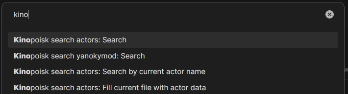
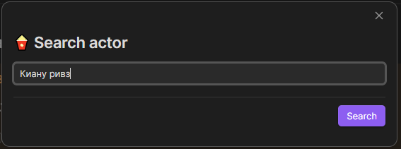
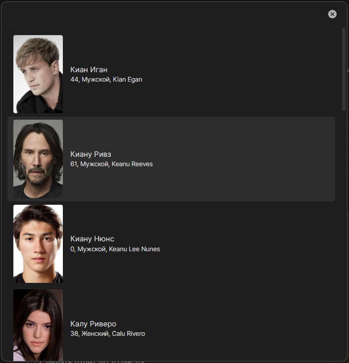
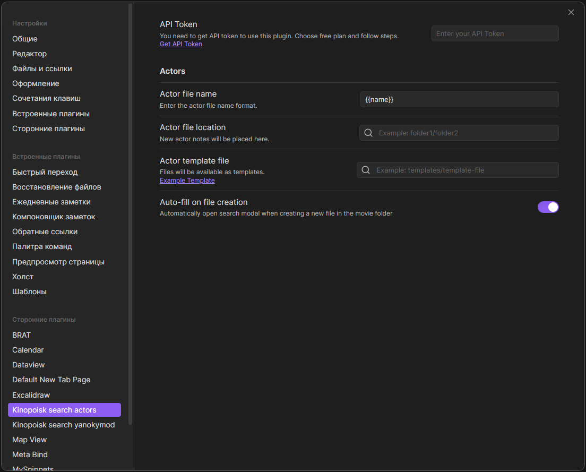

> The plugin is based on https://github.com/Alintor/obsidian-kinopoisk-plugin , thank you very much Alintor.
> 
> What are the differences from the Alintor plugin?
> 
> I have set up a search for actors, which is logical based on the name. 
> From an unusual one, I made a plugin trigger to create a file in the actors folder, this is done for links. For example, I have a link to Henry Cavill in the movie and a link in the format [[path to folder with actors/henry cavill]]. Then, when clicked, a note with the name Henry Cavill will be created and a query by the name of the note will be launched. If you want to disable it, there is a separate "auto-fill on creation file" option in the settings.
> 
>  It has also been modified to work with the [my other plugin that creates movies or TV series](https://github.com/Yanoky1/obsidian-kinopoisk-yanoky-plugin)


# Obsidian Kinopoisk Plugin

Easily search movies and tv shows info via Kinopoisk and create notes.

## Description

Search movies and tv shows info in Kinopoisk

Use Kinopoisk.dev API to get the information.

## How to install

For install copy link `https://github.com/Yanoky1/obsidian-kinopoisk-actors-yanoky-plugin` end use in BRAT plugin

## How to use

### 1. Click the ribbon icon, or execute the command "Search in Kinopoisk".



### 2. Search for movies or tv series by keywords.



### 3. Select the item from the search results.



### 4. Voila! A note has been created.


## Configure plugin in settings



### Get API Token

You need to get API token to use this plugin. Follow the [link](https://poiskkino.dev/), choose free plan and follow steps.

### New file name

You can set the file name format. The default format is `{{name}}`.

### New file location

Set the folder location where the new file is created. Otherwise, a new file is created in the Obsidian Root folder.

### Template file

You can set the template file location. There is an example template at the bottom.

### Auto-fill

Automatically open search modal when creating a new file in the movie folder


## Example template

Please also find a definition of the variables used in this template below (see: [Template variables definitions](#template-variables-definitions)).

```
---
Постер: "{{photo}}"
Название: "{{name}}"
Пол: "{{sex}}"
Супруг: "{{spouses}}"
Возраст: {{age}}
Дата_рождения: "{{birthday}}"
Дата_смерти: "{{death}}"
Рост: "{{growth}}"
Кинопоиск: "{{kinopoiskUrl}}"
---

  


## Информация

**Дата рождения**: "{{birthday}}"
**Пол**: "{{sex}}"  
**Возраст**: {{age}}
**Рост**: {{growth}}  
**Подробнее**: [{{kinopoiskUrl}}]({{kinopoiskUrl}})


```

## Template variables definitions

Please find here a definition of the possible variables to be used in your template. Simply write `{{name}}` in your template, and replace name by the desired data, including:

| name         | description                        |
| ------------ | ---------------------------------- |
| name         | name actor                         |
| photo        | poster image URL.                  |
| enName       | the alternative name of actor      |
| sex          | actor's gender                     |
| spouses      | the actor's wife                   |
| age          | age of the actor                   |
| birthday     | Actor's birthday                   |
| death        | date of the actor's death          |
| growth       | actor's height                     |
| kinopoiskUrl | The URL to actor page on Kinopoisk |
